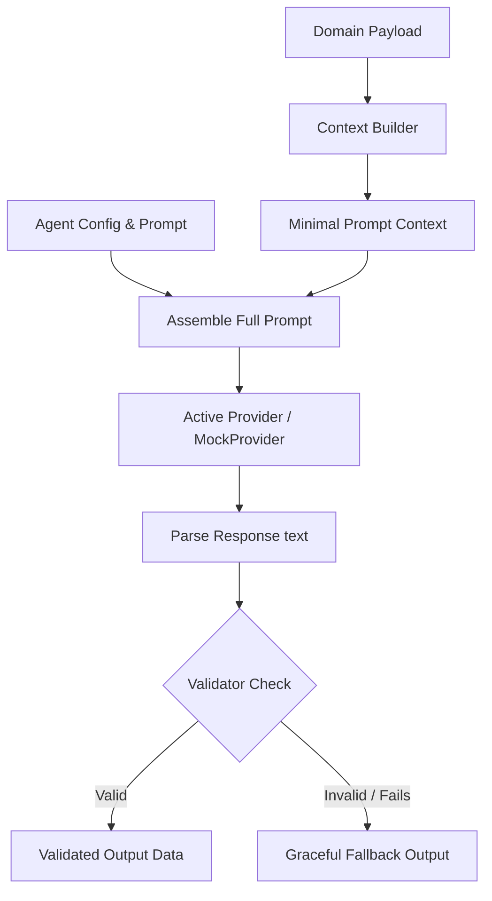

# StackAudit AI Foundation Architecture (Sprint 0)

This document provides a technical blueprint and architectural specification of StackAudit's provider-agnostic, contract-driven AI subsystems.

---

## 1. Folder Structure

All core AI components reside under `lib/ai/` and `config/`:

```
stackaudit/
├── config/
│   └── ai.ts                 # Main configurations (Active provider, model params)
├── lib/
│   └── ai/
│       ├── index.ts          # Unified index exports
│       ├── types.ts          # Common TypeScript interfaces & configurations
│       ├── orchestrator.ts   # Agent routing, pipeline handling, and contract validation
│       ├── context.ts        # Data minimizers mapping domain entities to prompt strings
│       ├── registry.ts       # Registry coupling agents to prompts, contexts, and schemas
│       ├── providers/
│       │   ├── base.ts       # Abstract BaseAIProvider class
│       │   └── mock.ts       # MockProvider returning schema-compliant test payloads
│       ├── prompts/
│       │   ├── audit.ts      # Audit Analyst prompt specs
│       │   ├── report.ts     # Executive Writer prompt specs
│       │   ├── ...           # Marketplace, chat, optimization, etc.
│       └── schemas/
│           ├── audit.ts      # Audit contract validators
│           ├── report.ts     # Executive summary validators
│           └── ...
```

---

## 2. Core Architectural Layers

### A. Provider Layer (`lib/ai/providers/`)
* **`BaseAIProvider`**: Defines standard signatures for `.generate()`, `.stream()`, `.health()`, and `.name()`.
* **`MockProvider`**: Implements `BaseAIProvider` to return deterministic mock responses based on validation schemas. Facilitates sandboxed client-side integration checks.

### B. Prompt Layer (`lib/ai/prompts/`)
* Prompts are managed as code files implementing `PromptConfig`.
* Each prompt configures its system message, metadata versioning, and whitelisted LLM engines.

### C. Context Layer (`lib/ai/context.ts`)
* Acts as a privacy filter. Transforms large domain entities into minimal plain text strings.
* Ensures no sensitive or database-specific metadata (such as internal keys) leaks to external provider endpoints.

### D. Validation Layer (`lib/ai/schemas/`)
* Defines target schema interfaces and validator functions to guarantee outputs conform to StackAudit contract shapes.
* Ensures the user interface never receives malformed or corrupt AI responses.

### E. Agent Registry (`lib/ai/registry.ts`)
* Acts as a centralized registry of domain agents: `Audit Analyst`, `Optimization Advisor`, `Executive Writer`, `Marketplace Expert`, `Procurement Advisor`, and `Ask StackAudit`.
* Configures metadata and bindings for prompt, context builder, and output validation schema.

### F. Orchestrator (`lib/ai/orchestrator.ts`)
* Coordinates execution:
  1. Retrieve target Agent configuration.
  2. Parse domain models through the context builder.
  3. Instantiate the configured Provider (e.g. `MockProvider`).
  4. Call the provider and capture JSON string.
  5. Validate structure against validation schemas.
  6. Return parsed response or graceful fallback data.

---

## 3. Data Flow



---

## 4. Switching Providers / Future Integration

To connect StackAudit to a live provider (e.g. Anthropic, OpenAI, or Gemini):
1. **Create Provider Implementation**: Add a new file under `lib/ai/providers/` (e.g. `openai.ts` or `anthropic.ts`) inheriting from `BaseAIProvider`.
2. **Install SDK**: Add the respective client package (`@google/generative-ai`, `@anthropic-ai/sdk`, etc.) when ready.
3. **Bind Config**: Update `config/ai.ts` to switch `provider` and specify target models.
4. **Register Provider**: Update `AIOrchestrator.getProvider()` to return your new provider instance depending on configuration settings.
